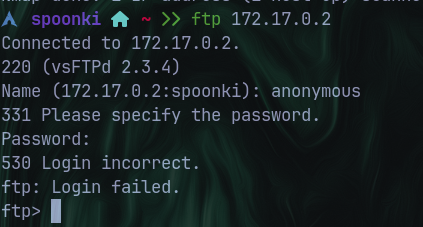

# Section 4 (Python)

bien , ahora si viene lo realmente bueno , pasamos a programacion , hasta este punto tendrias que tener nociones basicas de prgramacion , almenos en el lenguaje de entrada mas facil como lo es python , si no pues un video de 8 horas de python en youtube es suficiente para entrenar la mente xd

### Python Wrangling

este reto es de nivel medio , pero la primera vez que lo resolvi no tenia mucha idea de como hacer el reto , luego le vas tomando forma , todo es cuestion de practicar y practicar .

<figure><figcaption></figcaption></figure>

bien entonces el reto no dice que los programas en python se usan igual que programas en terminal o comandos en terminal , por lo que esto nos indica que podemos concatenar paremetros en una sola linea en la terminal.&#x20;

nos da los siguientes archivos

* ende.py
* password.txt
* flag.txt.en

y nos dice podemos correr ende.py usando password.txt para optener la flag.txt.en?

entonces lo que se me ocurre es ver los archivos para ver de que se trata.

<figure><figcaption></figcaption></figure>

<figure><figcaption></figcaption></figure>

como vemos si hacemos un cat al password.txt vemos que tenemos una serie de numeros que posiblemente si sea la contraseña necesaria , por otro lado esta la flag.txt.en que al parecer esta encryptado en base64 , por lo que necesitamos del programa ende.py para desencryptarlo.

<figure><figcaption></figcaption></figure>

si lo ejecutamos asi a secas nos dira su modo de uso , nos dice que le concatenemos una flag o parametro -e (encrypytar) o -d (desencryptar)  , como queremos desencryptar la flag del reto , usaremos el parametro -d .

<figure><figcaption></figcaption></figure>

como vemos nos pedira la contraseña , cuyo valor esta en el archivo password.txt , asi que lo copiamos y pegamos y listo.. no estaria entregando la flag del reto desencryptado.

<figure><figcaption></figcaption></figure>

### PW Crak 1

<figure><figcaption></figcaption></figure>

bien en este reto nos dice si podemos crakear la contraseña para optener la flag del reto.

entonces procedemos a descargar dos archivos , el programa en si de python que verificara la contraseña correcta , la flag encryptada , entonces pareceria un reto grande de cryptografia pero neh es algo mas facil , analizemos el codigo de python aver que nos encontramos.

<figure><figcaption></figcaption></figure>

pareceria algo muy complejo a primera instancia no? , pero analizemos un poco mas el codigo&#x20;

la primera funcion no es tan relevante par este reto , lo que nos interesa en realidad es esta seccion

`flag_enc = open('level1.flag.txt.enc', 'rb').read()`

aqui se define una variable que lo que hace en si es&#x20;

abrir el achivo bandera cifrado en modo lectura binaria

lee su contenido en la memoria

es por eso que ambos archivos deben de estar directamente en el mismo directorio para que no haya fallas al utilizar el programa

<figure><figcaption></figcaption></figure>

en esta otra seccion tambien es simple . lo que hace es lo siguiente

le pide al usuario que ingrese la contraseña correcta&#x20;

verifica si la entrada coincide con la contraseña correcta

descifra la flag y la muestra por pantalla si la contraseña es valida

pero hay una pequeña parte muy importante en esta seccion de codigo y es que&#x20;

`if( user_pw == "1e1a"):`\
`print("Welcome back... your flag, user:")`

lo que esta haciendo el programa es comparar directamente el input del usuario con una palabra ya definiida que es 1e1a , por lo que esto significa que

no se requiere fuerza bruta

la contraseña esta visible en el mismo codigo del programa

<figure><figcaption></figcaption></figure>

### Pw Crak 2

bueno aqui es igual necesitamos crakear la contraseña del programa para que nos decodifque la flag

<figure><figcaption></figcaption></figure>

analizamos el codigo del programa&#x20;

<figure><figcaption></figcaption></figure>

si vemos bien en la seccion de correborar la contraseña , ahora esta distinto , no como en el anteiror ejercicio que aparecia en texto plano la contraseña a verificar , aqui aparece en formato hexadecimal&#x20;

esto quiere decir que el chr() funcion convierte el valor numero a un caracter unicode , basicamente esto hace que la contraseña se costruya letra por letra usando valores hexadecimales , por lo que debemos pasarlos a decimal y luego buscarlos en una tabla ascii con su valor correspondiente , en este caso yo lo hice con la pagina cybercheft

<figure><figcaption></figcaption></figure>

| Valor hexagonal | Decimal | Carácter |
| --------------- | ------- | -------- |
| `0x33`          | 51      | 3        |
| `0x39`          | 57      | 9        |
| `0x63`          | 99      | c        |
| `0x65`          | 101     | e        |

<figure><figcaption></figcaption></figure>

### Pw Crack 3

vale aqui se pone un toque mas dificil por que nos ensuciaremos las manos y escribiremos codigo&#x20;

como prima isntancia nos dice que podriamos necesitar encryptar la contraseña para comparlarlo con el hash , pero para que hacerlo debemos de adiviniar cual es la contraseña para el programa cheker

<figure><figcaption></figcaption></figure>

